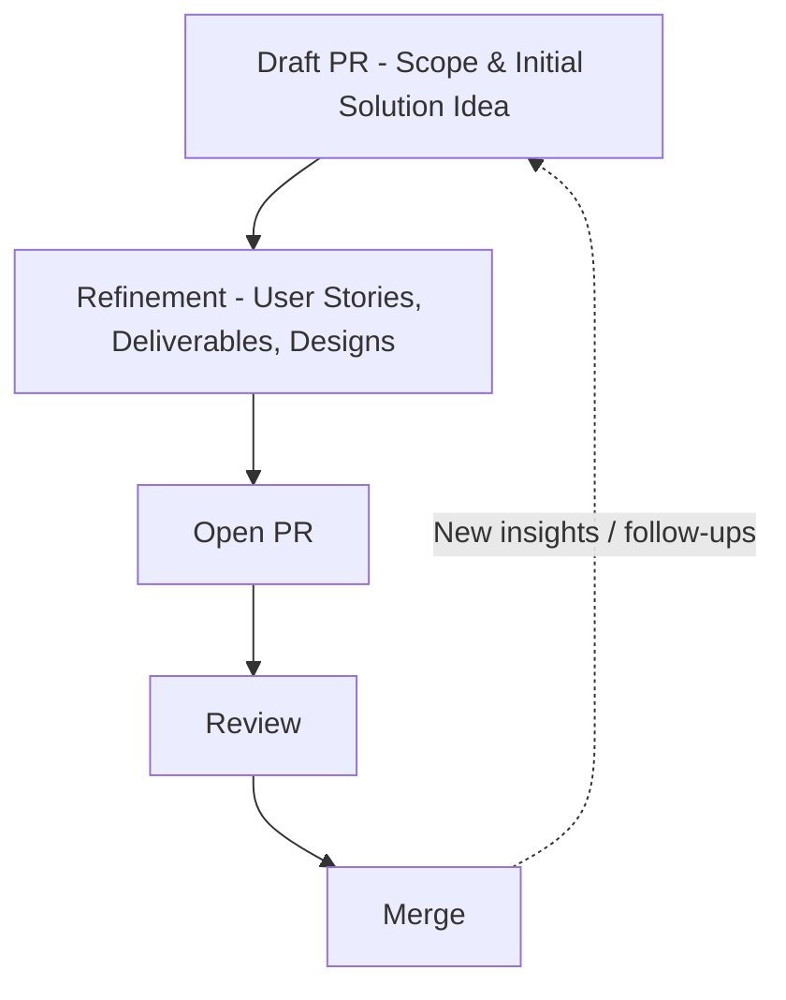

We structure our work along two parallel but connected tracks: **Discovery** and **Delivery**. In the **Discovery track**, we use GitHub Issues to capture ideas and define the problem space. Each Issue represents a problem, domain, or opportunity and becomes the place where discovery work is documented, from research notes and insights to domain understanding. 

In parallel, the **Delivery track** begins when we decide to address a problem by opening a draft Pull Request. The Pull Request describes the initial scope of the solution and links back to the relevant Issue. Over time, the PR is refined with emerging functional requirements in the form of User Stories, design documents, and deliverables such as user journeys or markdown files. 

Once refined, the PR moves into implementation: commits reference the Issue IDs, solutions are documented and developed in Obsidian or the IDE, and deliverables such as code or documentation are added to the repository. 

Through review and collaboration, the PR matures until it is ready to merge, at which point the repository reflects the new product increment. Importantly, every merge may surface new insights or problems, which in turn generate new Issues in the Discovery track. 

In this way, **Issues define the problem space, Pull Requests define the solution space, and the repository reflects the current state of the product**, creating a continuous and traceable loop between problem, solution, and implementation.

# 📦 Project Publishing Process for Solo Dev

## 1. Process Overview

* **Issues → Problem space**
* **PRs → Solution space**
* **Repo (branches & commits) → Implemented solution**

The publishing process is based on **Git, Obsidian, and GitHub**.
The goal is to **incrementally deliver improvements** to the repository in a transparent, traceable, and collaborative way.

* **Every change is tied to an Issue** (Problem definition).
* **Pull Requests describe the solution** (Proposal, design, implementation).
* **The Repository reflects the current state** of the implemented solution.

This creates a tight loop:
👉 **Issue → Branch → PR (draft → review → merge) → Release**

---

## 2. Workflow Steps

1. **Capture the Problem Space**

   * Use GitHub Issues to describe problems, ideas, or domains.
   * Start with a broad domain → create an Issue per domain/problem.
   * Add context, screenshots, or links from Obsidian notes.

2. **Create a Meaningful Branch**

   * Branch names should reference the Issue:
     `issue-42-plugin-boilerplate` or `feature/deliverable-name`.

3. **Open a Draft Pull Request**

   * Title: Reference the Issue and describe the intent.
   * Link relevant Issues.
   * Fill in the [Pull Request Template](docs/03%20-%20Resources/Templates/Pull%20Request%20Template.md) (Problem, Insight, Opportunity, Solution).
   * Use the draft state as a discussion/proposal.

4. **Iterate on the PR**

   * Work locally in Obsidian + code.
   * Commit changes to the branch with messages like:
     `#42 Added boilerplate plugin structure`.
   * Keep commits granular and descriptive.

5. **Request Review**

   * Move the PR from draft → open for review.
   * Collaborators refine the scope, suggest improvements.

6. **Merge and Publish**

   * Once accepted, merge into `main`.
   * Repo now reflects the increment.
   * Optionally: tag a release candidate.

---

## 3. Mental Model

* **Issues**: Capture problems, ideas, domains → the *Why*.
* **PRs**: Propose and refine solutions → the *What & How*.
* **Branches & Commits**: Implement changes → the *Done*.
* **Obsidian**: Knowledge base + design documentation (inputs).
* **GitHub**: Collaboration + traceability (outputs).

Think of it as:
🔎 *Problem discovery* (Issues) → 🛠 *Solution design* (PRs) → 🚀 *Increment delivery* (Merge).

# 🧭 Project Publishing Model for Teams

## 1. Problem Space → Issues

* Issues define **problems, domains, or opportunities**.
* Discovery work (notes, research, insights) is documented directly in the Issue.
* Issues remain **problem-focused**: *what hurts, what’s unclear, what needs exploration*.

**Artifacts linked to Issues:**

* Research notes (Obsidian)
* Domain maps, Jobs to be Done
* Problem statements

---

## 2. Solution Space → Pull Requests

* Pull Requests describe **proposed solutions and increments**.
* They serve as the **unit of work** for design + implementation.
* During refinement, **functional requirements (User Stories)** emerge and are added as Deliverables to the PR.
* PRs evolve over their lifecycle:

  * **Draft** → proposed scope & direction
  * **Refinement** → add design, user stories, requirements
  * **Open** → implementation & review
  * **Merge** → product increment delivered

**Artifacts linked to PRs (Deliverables):**

* User Stories (functional requirements)
* User Journeys, Wireframes, Design Files
* Markdown deliverables (README, architecture docs)
* Code & tests

---

## 3. Repository → Implemented Solution

* The repository reflects the **current state of the solution**.
* Obsidian and the IDE are the primary authoring tools.
* Commits reference Issue/PR IDs to maintain traceability.
* Deliverables (docs & code) live **side-by-side** in the repo.

---

## 4. Flow of Work

1. **Define Problem Space:**
   Capture domains & issues → document discovery inside Issues.
2. **Select Next Problem:**
   Product Owner creates a branch + draft PR tied to the Issue.
3. **Scope the Solution:**
   Use the PR template to describe scope, assumptions, key deliverables.
4. **Refine the PR:**
   Collaboratively define User Stories, add design docs & notes.
5. **Break Down into Smaller PRs:**
   If scope grows, split into sub-PRs each tracking a User Story or specific deliverable.
6. **Implement & Review:**
   Work on branch → commits reference Issue/PR → request review.
7. **Merge & Release:**
   Repo updated with solution increment; optional tag for versioning.

---

## 5. Mental Model

* **Issues** = “Why / What problem?” (Discovery)
* **PRs** = “What / How solution?” (Delivery)
* **Repo** = “What is live?” (Increment)

💡 Think of a PR as a **mini-release package**: it holds context, design, requirements, and the implemented solution.

---

## 6. High-Level Flow (Diagram)

### 📝 Explanation of Lifecycle

* **Draft PR**
  Frame the problem-solution scope, link Issues, outline high-level expectations.

* **Refinement**
  Collaboratively add *User Stories*, *User Journeys*, *Design Docs*, and scope Deliverables.
  The PR becomes a *release package blueprint*.

* **Open PR**
  Active development phase: commits reference Issue IDs, code + docs get pushed.

* **Review**
  Feedback loop with stakeholders, refining both *solution* and *documentation*.

* **Merge**
  Product increment delivered → repo updated.

💡 The PR isn’t just code, it’s the **container for solution design + implementation**, traceable to the Problem Space (Issues).

